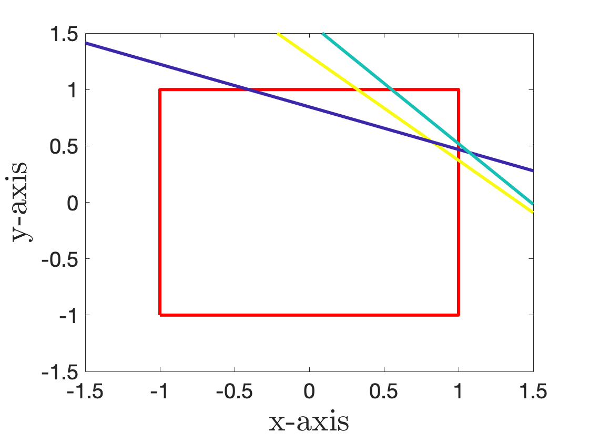
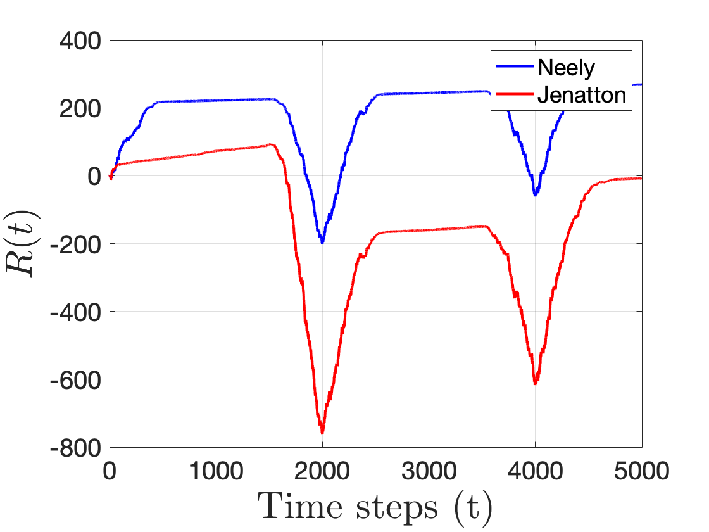
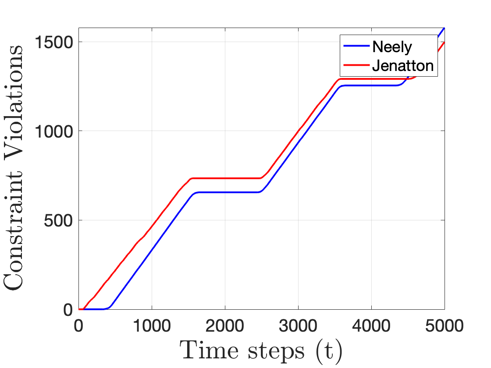

# OCO-Long-Term-Constraints
A MATLAB implementation of algorithms from the following papers on Online Convex Optimization (OCO) with long term constraints on the example problem from 1 below: 
1. [A Low Complexity Algorithm with O(√T) Regret and O(1) Constraint Violations for Online Convex Optimization with Long Term Constraints](https://jmlr.org/papers/v21/16-494.html)
2. [Adaptive algorithms for online convex optimization with long-term constraints](https://proceedings.mlr.press/v48/jenatton16.html)

## Dependencies 
MATLAB R2018a + (should work with lower versions as well)

## Usage for T=5000 time steps
main(5000)

## Results 
### True action region and constraints 

### Cummulative regret 

### Cummulative constraint violations

